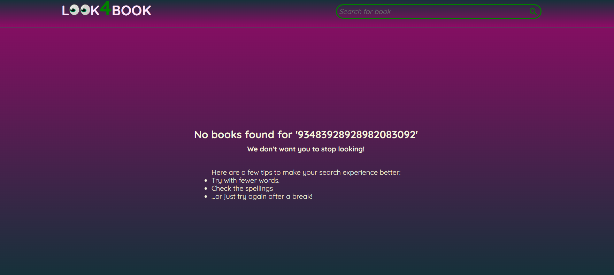

# API Search Engine

## Project Description

The goal of this project is to provide a search interface to the user for a book inside the Google Books database and to get details about a book title.

## Project Requirements

- Project has to be in REACT and use asynchronous programming
- A page with a header and introduction that allows users to search for books
- A form containing a text input and a submit / search button
- A gird/ flexbox to display search results
- Results retrived by API request to Google books API using the input value as query string
- Each book in the grid should have an image, author, title and description
- The grid should be responsive on different screen sizes
- A services file for requesting the data.
- Each component should have its own SCSS file
- Give feedback to the user when no book results can be found for the query.

## Implementation Details:

### Design and Styling:

Implemeneted as single page application that used different styling options for when the user first lands on the page and when search results are displayed. When search results are displayed the header moves to the top of the page.

#### Landing Page

#### Search Results

### Tools Used:

- React
- SASS

### Code Structure:

The code is distributed in components,services and containers modules to separate logic from view.

#### Functional Components and Containers

The following is the list of React functional components:

- Header
  - Title
  - SearchBar
- **BooksLoader** (container)
  - ErrorMessage
  - LoadingSpinner
  - SearchResults
    - PagingInformation
    - ResultsSelector
    - BooksGrid
      - BooksCard
    - PageSelector
- Footer

#### services

Data services make api calls to Google API to fetch data.It
uses fetch, async and await.

#### container

BooksLoader container encapsulated the logic and error handling for bringing the search results and getting them ready for display.

### Features

#### Books Grid

The search results are displayed as a repeating grid of book cards. It is responsive to different screen sizes.

#### Book Page Flip

The books are displayed as a book cover and when a user hovers over them the title page flips to reveal details about the book. The user can click on the book card to zoom in further and see more information about the title.

#### Book modal

The extra information is displayed in a modal which is also responsive.

#### Pagination

The application displays information on how manny books are displayed and allows the user to select page number and number of books to display on each page.

#### Error Page

A customised error message is displayed when something goes wrong.

#### Loading Spinner

A loading spinner is displayed while results are being fetched.

## Future Direction

- Advanced search for authors, language etc. can be added.
- Sorting option based on titles , authors etc. can be added.
